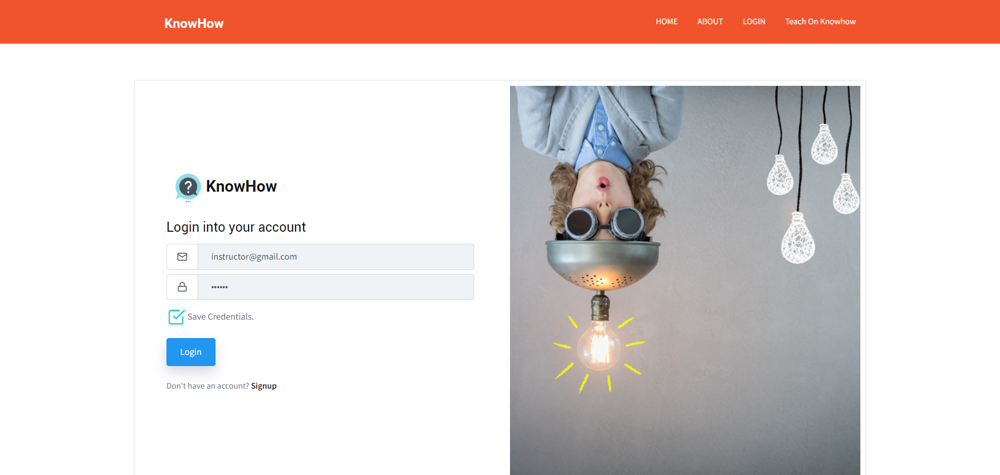
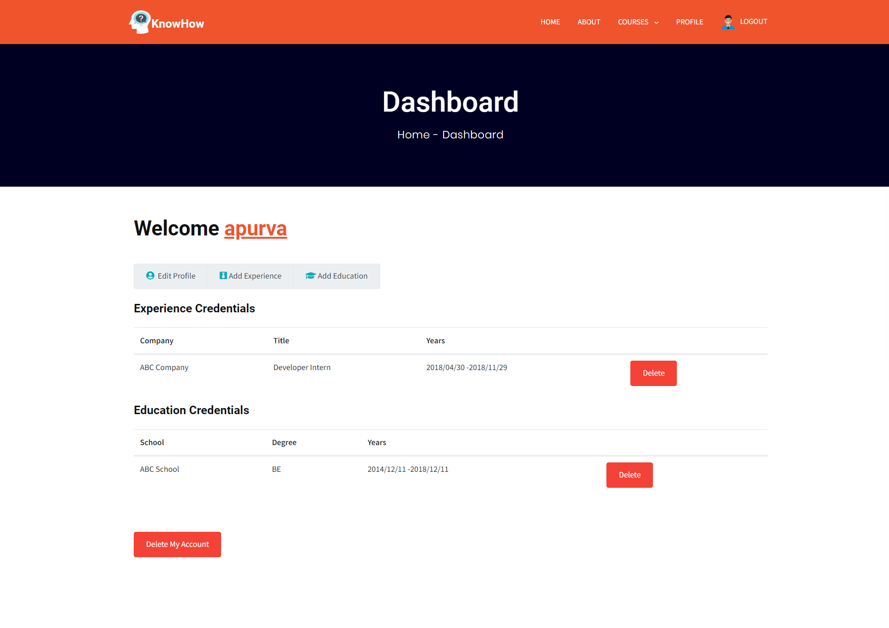
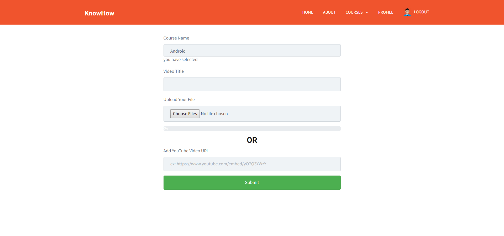
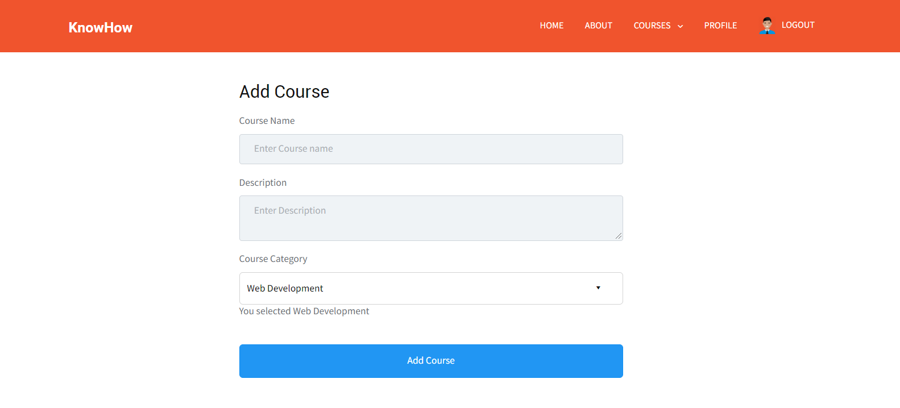
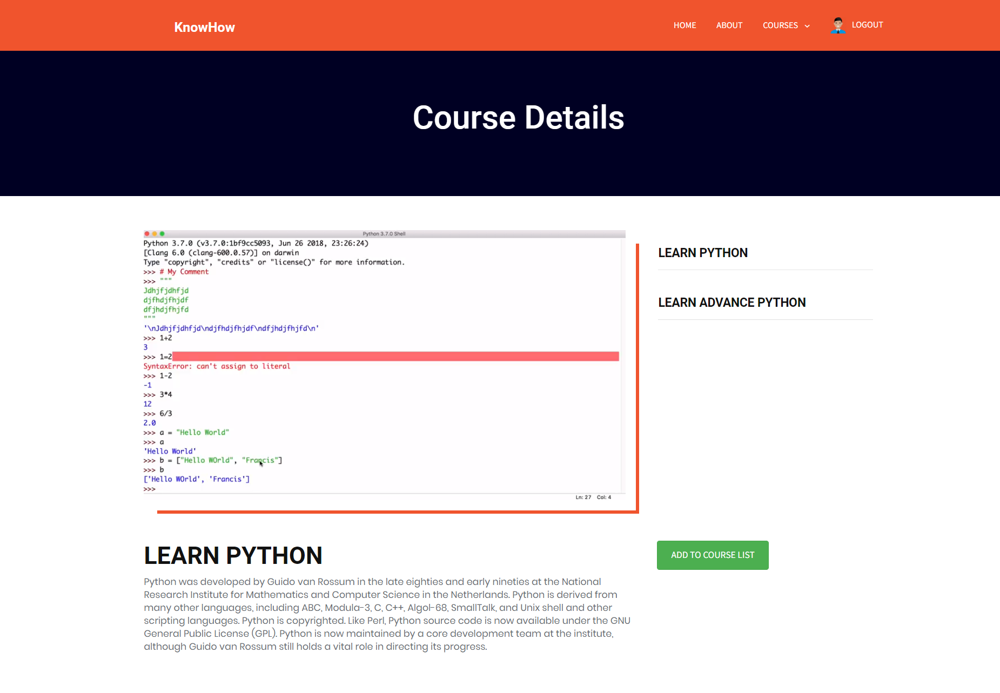
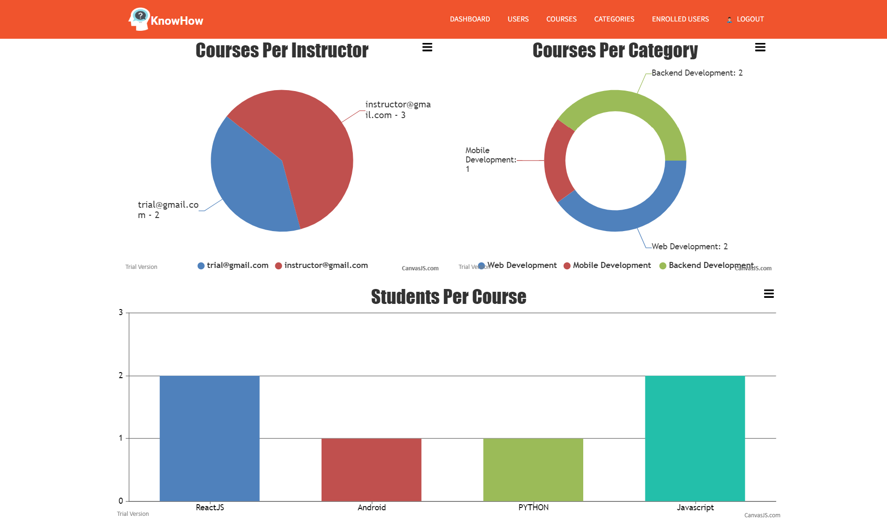
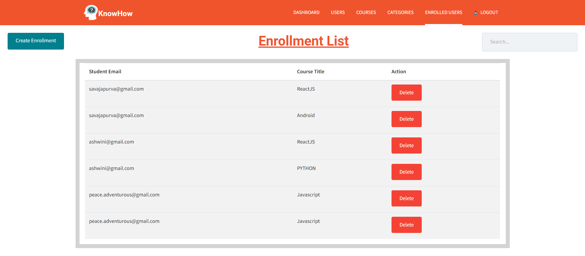
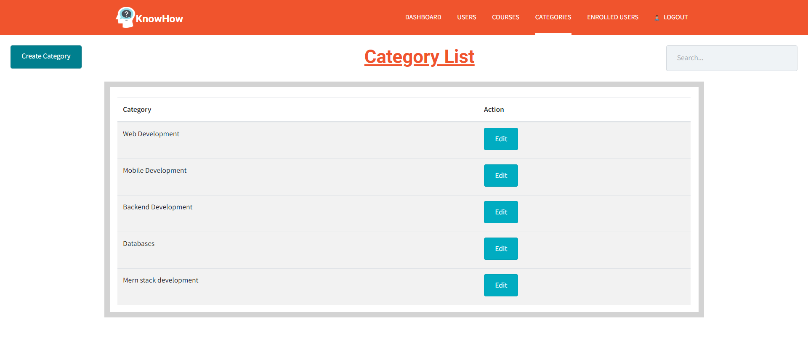
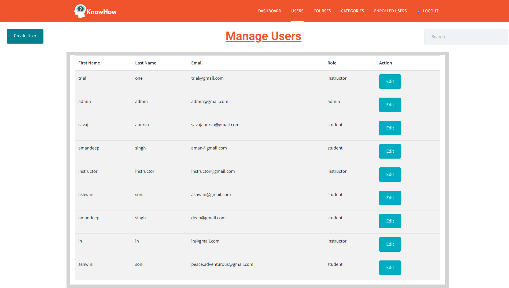
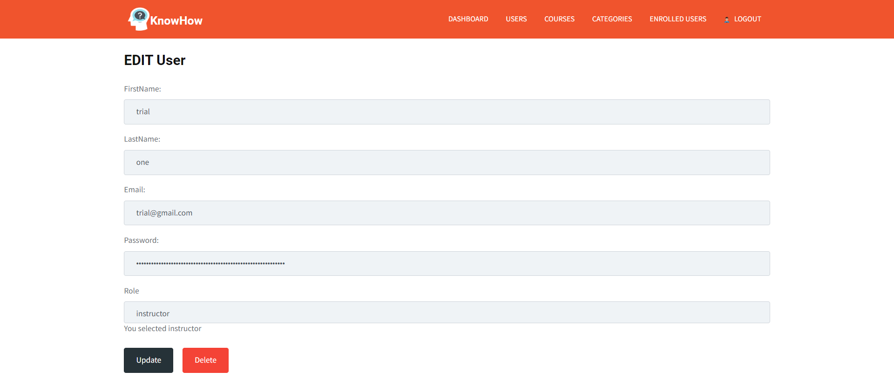

# E-Learning-MERN
It is a E-Learning website which provides functionality of registering in any course and watch its related videos and many other features such as Admin Panel, Instructors related functions etc. 


---

## Quick Start

```bash
# clone repository
https://github.com/savajapurva/E-Learning-MERN.git

# Install dependencies
cd E-Learning-MERN && npm install
cd E-Learning-MERN && cd client && npm install

```
Create account in Mongo Atlas and create cluster. Get your MongoURI by following the instructions and add it in keys.js file which is inside the config folder. 

```
secretOrKey=ANY_SECRET
mongoURI: 'YOUR_URI'

```

To run the development server:

```bash
# the development server runs on port 3000
npm run dev
```

To run production build:

```bash
# create code bundle
npm run build

# run production server
npm run prod
```
---

## Instructor's Portal



---



---



---



---

## Student's Portal


---



---


---

## Admin Portal



---



---



---



---



---

## Main Technologies

### Client Side

- [x] **[React](https://github.com/facebook/react)**
- [x] **[Redux](https://github.com/reactjs/redux)**
- [x] **[Bootstap 4](https://github.com/twbs/bootstrap/tree/v4-dev)**
- [x] **[React-Router-DOM](https://github.com/ReactTraining/react-router/tree/master/packages/react-router-dom)**

#### Libraries used in Client-side

- [x] **[axios](https://github.com/axios/axios)**
- [x] **[classnames](https://github.com/JedWatson/classnames)**
- [x] **[react-moment](https://github.com/headzoo/react-moment)**
- [x] **[react-redux](https://github.com/reduxjs/react-redux)**
- [x] **[redux-thunk](https://github.com/reduxjs/redux-thunk)**
- [x] **[validator](https://github.com/chriso/validator.js)**
- [x] **[canvasjs]()**
- [x] **[file-loader]()**
- [x] **[fs-extra]()**
- [x] **[canvasjs]()**
- [x] **[node-sass]()**
- [x] **[postcss-loader]()**
- [x] **[react-countup]()**
- [x] **[react-modal-video]()**
- [x] **[react-toastify]()**
- [x] **[react-visibility-sensor]()**
- [x] **[reactjs-popup]()**
- [x] **[reactstrap]()**
- [x] **[sass-loader]()**
- [x] **[semver]()**
- [x] **[swiper]()**
- [x] **[url-loader]()**
- [x] **[animate.css]()**


### Server Side

- [x] **[Node.js / Express](https://github.com/expressjs/express)**
- [x] **[MongoDB](https://github.com/mongodb/mongo)**
- [x] **[JWT](https://github.com/auth0/node-jsonwebtoken)**
- [x] **[Passport](http://www.passportjs.org/)**
- [x] **[Passport-jwt](https://github.com/themikenicholson/passport-jwt)**

#### Libraries used in Server-side

- [x] **[express-fileupload](https://github.com/dcodeIO/bcrypt.js)**
- [x] **[bcryptjs](https://github.com/dcodeIO/bcrypt.js)**
- [x] **[gravatar](https://github.com/emerleite/node-gravatar)**
- [x] **[mongoose](http://mongoosejs.com/)**
- [x] **[jwt-decode](https://github.com/auth0/jwt-decode)**
- [x] **[moment](https://momentjs.com/)**
- [x] **[validator](https://github.com/chriso/validator.js)**
- [x] **[cors]()**
- [x] **[jsonwebtoken]()**
- [x] **[body-parser]()**
